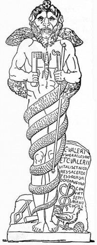

# Glyxon-Zurvatronics ⚙️🧬
**Analytical Models of Subtractive Ontology and Informational Collapse in Molecular Motors**

**Author:** David J. Castillo-Cornejo (2026)  
**Affiliation:** Synthetic Biosystems Lab, Glyxon Biolabs  
**Contact:** [glyxonbiolabs@gmail.com](mailto:glyxonbiolabs@gmail.com)

---

  <h2>🎮 Research Visualizers & Tools</h2>
  
Explore the transition from population-level phase diagrams to single-stator micro-mechanics.

  
  <table>
    <tr>
      <td align="center">
        <strong>1. Population Collapse (Zurvān Gap)</strong> 
        
      </td>
      <td align="center">
        <strong>2. Micro-Mechanics (Power Stroke)</strong> 
        
      </td>
      <td align="center">
        <strong>3. Java Source Code</strong> 
        
      </td>
    </tr>
  </table>

---

## 👁️ The Subtractive Agency Manifesto
Zurvatronics proposes an inhibitory framework: biological agency emerges not from added complexity, but from the **systematic subtraction of informational entropy**—the topological "pruning" of non-functional stochastic trajectories from a system's conformational phase space. 

The flagellar motor is our primary case study. We argue that biomolecules do not compute in order to move; they compute to persist. The macroscopic mechanical work observed is the byproduct of this continuous informational inhibition.

## 📜 Theoretical Foundation & Mathematical Formalism
The models are grounded in the unification of Shannon information theory and stochastic thermodynamics:

### 1. The Swineshead Latitudo $L(T)$
Formalized from medieval intensity calculus (*latitudo formarum*), the instantaneous filtering capacity is:
$$L(T) = k_B T \ln(2) \cdot [H_{max} - H(S,T)]$$

### 2. The Zurvān Coefficient $Z$
Agency emerges from the temporal accumulation of filtering capacity over the proton's residence time ($\tau_{res}$):
$$Z = \int_{0}^{\tau_{res}} L(T,t) dt$$
As rotational speed increases, $Z$ drops below the critical threshold ($Z_c$); the motor runs out of time to compute its existence.

### 3. The Inhibitory Operator (Modified Langevin)
We introduce $\Psi_Z(t)$ as an additive counter-force in the dynamics:
$$m \frac{dv}{dt} = F_{PMF} - \eta v - [P_{assembly} \cdot \Psi_Z(t)] + \xi(t)$$

### 4. Resolving the Zero-Load Controversy
This framework resolves the Nirody vs. Wang paradox. The near-zero load regime is identified as a zone of fundamental informational instability ($\zeta \approx 1$), where the system is hypersensitive to marginal experimental drag.

---

## ⚙️ Micro-Mechanics: Stick-Slip & Power Stroke
While the Phase Diagram shows population stability, the **Java-based Stick-Slip model** describes the lifecycle of a single stator:
* **The Stick Phase ($Z \uparrow$):** Structural tension accumulates as the stator "prunes" paths.
* **The Slip Phase ($Z \ge Z_c$):** The informational anchor collapses, triggering the **Power Stroke** (velocity spike).

## 📂 Repository Architecture
* `/interactive_sim/`: Web visualizers and the high-performance `PowerStrokeSim.java` source.
* `/src/mathematica/`: Analytical notebooks for Figures A/B and *Latitudo* derivations.
* `/docs/`: `Castillo-Cornejo_ALIFE2026-FINAL.pdf` - Full theoretical manuscript.

---

## ⏳ Philosophical Context: Why "Zurvatronics"?

The nomenclature is derived from **Zurvanism**, a branch of Zoroastrianism that posited *Zurvān* (Infinite Time) as the primordial creator. This mirrors our ontology: agency is not a "vital spark", but the use of physical structure to "buy time" ($\tau_{res}$) to filter chaos into order. 

The **Zurvān Coefficient ($Z$)** measures how much "time" a system has successfully converted into informational order.

*(Image: The Leontocephaline deity of Ostia Antica, holding the keys of cosmic passage and encircled by the serpent of eternal cycles).*

**Key Reference:** > Zaehner, R. C. (1955). *Zurvan: A Zoroastrian Dilemma*. Oxford: Clarendon Press.

---

## 🔬 Experimental Challenge
We challenge the community to test these postulates by measuring the stator turnover rate ($k_{off}$) at the macroscopic torque "knee" using ΔmotCD / ΔmotAB mutant programs. The predicted synchronization between $Z$ collapse and velocity spikes provides a falsifiable signature of Subtractive Agency.

## 🗺️ The Zurvatronic Roadmap
1. **Taxonomy:** Classifying molecular machines by informational stability boundaries.
2. **Abiogenesis:** Mapping the moment non-living chemistry becomes a Zurvatronic agent.
3. **Cognition:** Scaling the Latitudo to Friston's **Free Energy Principle** (the brain computes to persist against entropic noise).

---
*Maintained by Glyxon Biolabs - Independent Research & Frugal Science.*
